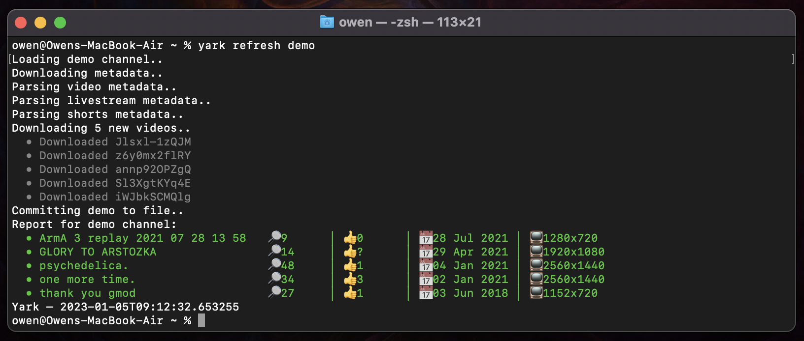

<!-- TODO: logo; #2 <https://github.com/Owez/yark/issues/2> -->
<!-- TODO: add when logos done; #2 <https://github.com/Owez/yark/issues/2>: <h1 align="center">yark</h1> -->

# Yark

YouTube archiving made simple.

[Installation](#installation) · [Managing your Archive](#managing-your-archive) · [Viewing your Archive](#viewing-your-archive)

Yark lets you continuously archive all videos and metadata for YouTube channels and playlists. You can also view your archive as a seamless offline website ✨

## Installation

To install Yark, simply download [Python 3.11+](https://www.python.org/downloads/) and [FFmpeg](https://ffmpeg.org/) (optional), then run the following:

```shell
$ pip3 install yark
```

## Managing your Archive

Once you've installed Yark, think of a name for your archive (e.g., foobar) and copy the channel/playlist url:

```shell
$ yark new foobar https://www.youtube.com/channel/UCSMdm6bUYIBN0KfS2CVuEPA
```

Now that you've created the archive, you can tell Yark to download all videos and metadata using the refresh command:

```shell
$ yark refresh foobar
```

Once everything has been downloaded, Yark will automatically give you a status report of what's changed since the last refresh:

<p></p>

## Viewing your Archive

Viewing you archive is easy, just type `view` with your archives name:

```shell
$ yark view foobar
```

This will pop up an offline website in your browser letting you watch all videos 🚀

<p></p>

Under each video is a rich history report filled with timelines and graphs, as well as a noting feature which lets you add timestamped and permalinked comments 👐

<p></p>

Light and dark modes are both available and automatically apply based on the system's theme.

## Roadmap

Here's the general roadmap for Yark going a few months into the future for the upcoming features and changes:

1. Yark 1.3 (Current): [Comments](https://github.com/Owez/yark/issues/50), [viewer tabs](https://github.com/Owez/yark/issues/30), [playlists](https://github.com/Owez/yark/issues/27), [viewed](https://github.com/Owez/yark/issues/51)
2. Yark 1.4 (Expected ??): [Run command](https://github.com/Owez/yark/issues/83), [better homepage](https://github.com/Owez/yark/issues/65), [more graphs](https://github.com/Owez/yark/issues/74), [translations](https://github.com/Owez/yark/issues/73)
3. Yark 1.5 (Expected ??): Full [GUI control](https://github.com/Owez/yark/issues/86) for archives and viewer polish/rewrite
4. Onwards: Not sure yet, [create an issue](https://github.com/Owez/yark/issues/new) to help out :) 

## Details

Some things to keep in mind when using Yark; the good and the bad:

- Don't create a new archive again if you just want to update it, Yark accumulates all new metadata for you via timestamps
- Feel free to suggest new features via the issues tab on this repository
- Scheduling isn't a feature just yet, please use [`cron`](https://en.wikipedia.org/wiki/Cron) or something similar!
