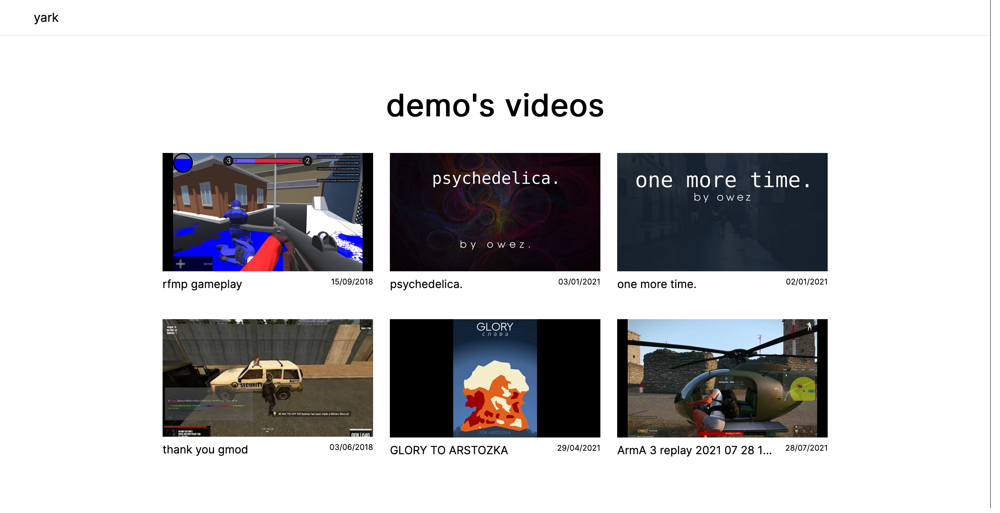

<!-- TODO: logo -->
<!-- TODO: add when logos done: <h1 align="center">yark</h1> -->

# yark

YouTube archiving made simple.

- [yark](#yark)
  - [Installation](#installation)
  - [Managing your Archive](#managing-your-archive)
  - [Viewing your Archive](#viewing-your-archive)

Yark lets you continuously archive all videos and metadata of a channel. You can also view your archive as a seemless offline website 🦾

## Installation

To install yark, simply download it off of PyPI:

```shell
$ pip3 install yark
```

## Managing your Archive


Once you've installed yark, think of a name for your archive and copy the target's channel id:

```shell
$ yark new owez UCSMdm6bUYIBN0KfS2CVuEPA
```

Now that you've created the archive, you can tell yark to download all videos and metadata:

```shell
$ yark refresh owez
```

Here's what my channel looked like after following the steps (if anything was updated/deleted it would be blue/red to indicate):

<p></p>

<!-- TODO: new demo, this one doesn't include video downloading. maybe include blue/red -->

Right now scheduling isn't a feature so to run the archiver every now and then please use [`cron`](https://en.wikipedia.org/wiki/Cron) or something similar. Once a day is recommended because getting metadata takes ages!

## Viewing your Archive

Viewing you archive is very simple, just type `view` and optionally the archive name:

```shell
$ yark view owez
```

This will pop up an offline website in your browser letting you access all videos 🚀

<p></p>
